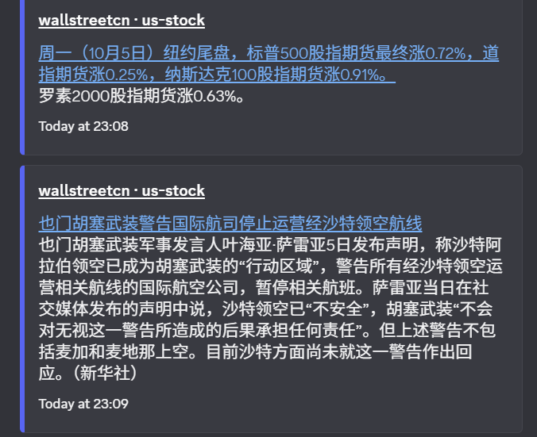
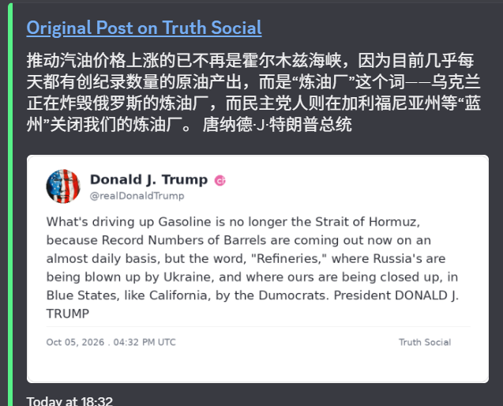
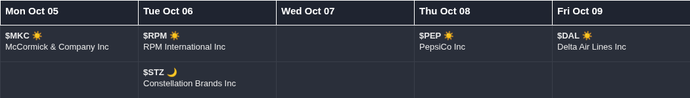
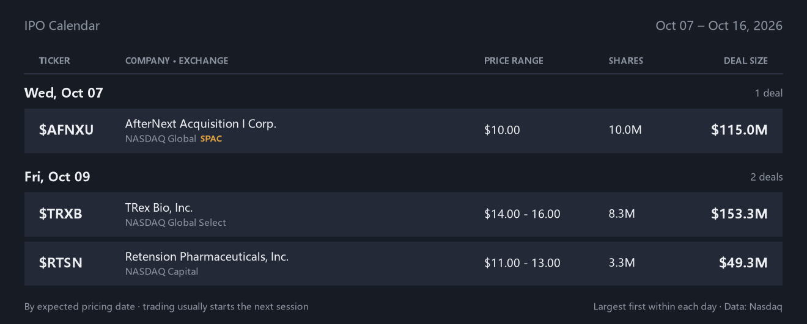
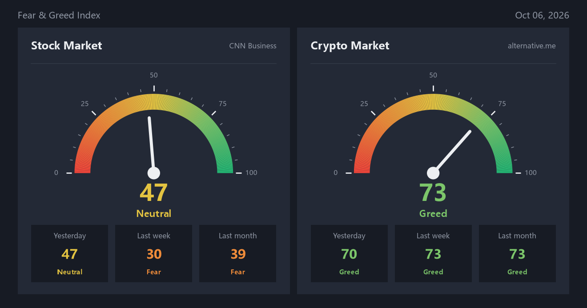
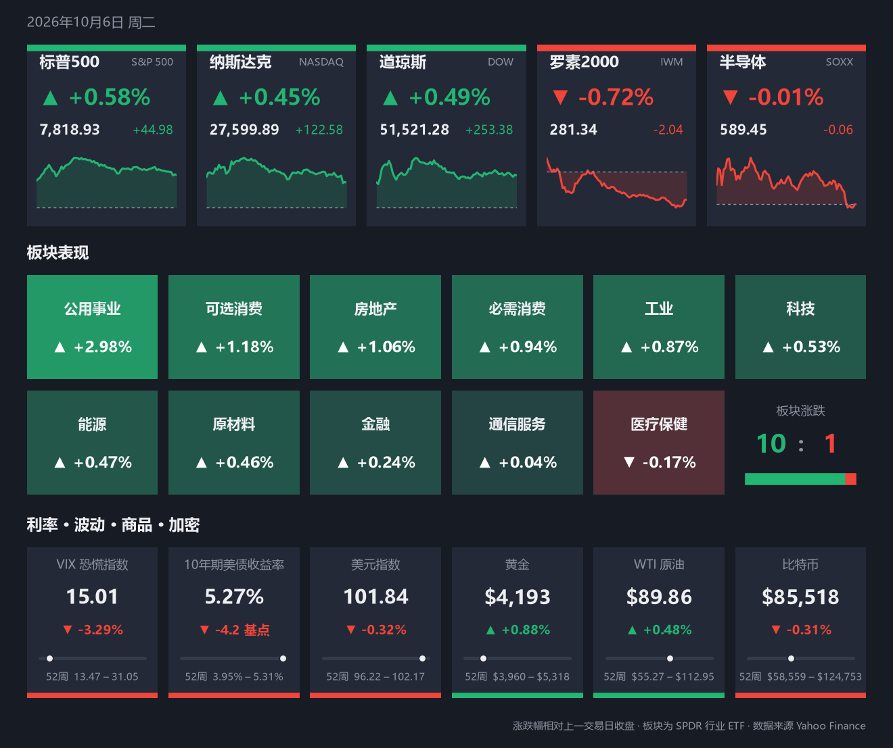
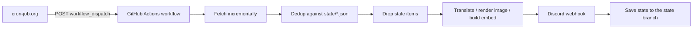

# market-pulse-discord

[](https://github.com/EST320/market-pulse-discord/actions/workflows/tests.yml)
[](LICENSE)

Financial news and market-indicator trackers that run on GitHub Actions and post to Discord. Each tracker pulls incrementally from a public data source, deduplicates, filters, formats, and delivers through a Discord webhook.

In production since July 2026.

| Flash news | Truth Social |
|---|---|
|  |  |

| Earnings calendar | IPO calendar |
|---|---|
|  |  |

| Fear & Greed | Market close |
|---|---|
|  |  |

## Trackers

| Tracker | Source | Posts | Cadence |
|---|---|---|---|
| [`wallstreetcn`](market_pulse/wallstreetcn.py) | Wallstreetcn live feed: US, A-share and HK channels | Headline + body | Every 2 minutes per channel |
| [`truth_social`](market_pulse/truth_social.py) | CNN's public Truth Social archive | Chinese translation + card image of the original post | Every 5 minutes |
| [`fear_greed`](market_pulse/fear_greed.py) | CNN Fear & Greed Index, alternative.me Crypto Fear & Greed Index | One image with both gauges and their history, plus the change since last run | Scheduled |
| [`earnings_calendar`](market_pulse/earnings_calendar.py) | Nasdaq's public calendar API, Yahoo Finance | One image of next week's most actively traded reporters, a column per day, with market cap and consensus EPS | Fridays after the US close |
| [`market_close`](market_pulse/market_close.py) | Yahoo Finance | Chinese-language image: S&P 500, Nasdaq, Dow, Russell 2000 (IWM), semiconductors (SOXX), a heat map of the 11 sectors, VIX, 10-year yield, dollar index, gold, oil, bitcoin | Weekdays, 4:15 pm New York time |
| [`ipo_calendar`](market_pulse/ipo_calendar.py) | Nasdaq's public calendar API | One image of the US IPOs expected to price from today through the end of next week, grouped by day | Fridays, right after the earnings calendar |
| [`backfill`](market_pulse/backfill.py) | Wallstreetcn (all three channels) | Flash news missed during an outage window | Manual |

The Wallstreetcn feed is Chinese, and Truth Social posts are translated into Chinese, so most of the Discord output is Chinese-language. Code, logs and documentation are in English.

## How it works



1. **Incremental fetch.** Page through the source by cursor and stop at the first already-seen item or the first page that falls outside the age window. No full scans.
2. **Dedup.** Compare item IDs against the state file. The Truth Social archive can return the same post under different IDs, so that tracker adds a second layer keyed on a hash of the content.
3. **Age filter.** Skip items that are too old or have no timestamp (15 minutes for flash news, 12 hours for Truth Social), so historical content is never pushed by accident.
4. **Format.** Translate with DeepL, render images with Pillow / Matplotlib, and build the Discord embed.
5. **Deliver.** Post through a Discord webhook. An item is written to state **only after it has been delivered**, so a failure midway neither repeats what was sent nor loses what wasn't.
6. **Persist.** The workflow saves the state file to the `state` branch for the next run to read.

## Repository layout

```text
market-pulse-discord/
├── .github/workflows/
│   ├── news.yml / news-a.yml / news-hk.yml   # Wallstreetcn US / A-share / HK
│   ├── news-trump.yml                        # Truth Social
│   ├── feargreed.yml                         # Fear & Greed indices
│   ├── weekly-calendars.yml                  # Weekly earnings calendar, then IPO calendar
│   ├── market-close.yml                      # Daily US market close summary
│   ├── backfill.yml                          # Manual backfill
│   ├── market-now.yml                        # /market slash command: summary on demand
│   ├── register-commands.yml                 # One-off: register the slash commands
│   └── tests.yml                             # Unit tests on code changes
├── market_pulse/
│   ├── wallstreetcn.py                       # One module, three channels
│   ├── backfill.py                           # Reuses wallstreetcn parsing and posting
│   ├── truth_social.py
│   ├── fear_greed.py
│   ├── earnings_calendar.py
│   ├── ipo_calendar.py
│   ├── market_close.py
│   ├── discord.py                            # Shared webhook client with bounded 429 retries
│   ├── nasdaq.py                             # Client for Nasdaq's public calendar API
│   ├── yahoo.py                              # 20-day average dollar volume from Yahoo Finance
│   ├── fonts.py                              # Finds a Chinese-capable font for chart text
│   ├── theme.py                              # Shared dark palette and helpers for chart images
│   └── paths.py                              # Repo-relative state/ and assets/ paths
├── bot/
│   ├── worker.js                             # Cloudflare Worker that receives slash commands
│   ├── wrangler.toml                         # Its deployment configuration
│   └── register_commands.py                  # Registers the slash commands with Discord
├── scripts/
│   ├── save_state.sh                         # Publishes state files to the state branch
│   └── inspect_wallstreetcn_tags.py          # Debug helper: dump raw API fields
├── requirements/                             # Pinned dependencies, one file per tracker
├── state/                                    # Not on main: checkout of the `state` branch
├── assets/                                   # Static images used in generated cards
├── docs/screenshots/
└── tests/
```

Every tracker is a module run with `python -m market_pulse.<name>` from the repository root.

## Reliability

| Problem | Handling |
|---|---|
| Source API fails temporarily | Wallstreetcn: up to 3 attempts with linear backoff; if it still fails the run is skipped without failing the workflow, and the next run catches up |
| Discord rate limit (HTTP 429) | Every tracker posts through one shared client that waits for the returned `retry_after` and gives up after 5 attempts per message |
| Exception midway through a run | Wallstreetcn writes state in a `finally` block; Truth Social saves state after every delivered post |
| Corrupt state file | Treated as empty state; the run takes the first-run path instead of crashing |
| First run | Wallstreetcn sends only the latest 10 items and marks the rest as seen; Truth Social only records a baseline and sends nothing |
| State file growth | Entries are pruned after a retention period (12 hours for flash news, 30 days for Truth Social) |
| Concurrent runs writing state | Each tracker runs serially in its own `concurrency` group. Different trackers save with a compare-and-swap push and retry on conflict, so they never overwrite each other's files |
| Gaps after an outage | `backfill` re-sends a time window, skipping recorded IDs, with a `DRY_RUN` mode |

## Design decisions

### Triggering: an external scheduler calls `workflow_dispatch`

Flash news needs a steady poll roughly every 2 minutes. GitHub Actions' built-in `schedule` is delayed or skipped under load and cannot hold that cadence, so an external scheduler (cron-job.org) triggers the workflows through the GitHub REST API:

```text
cron-job.org, every N minutes
  → POST /repos/{owner}/market-pulse-discord/actions/workflows/{workflow}.yml/dispatches   body: {"ref": "main"}
  → workflow runs the tracker → posts to Discord → saves the state file to the state branch
```

A side benefit is that changing the cadence, pausing or resuming a tracker needs no code change. Every tracker runs on `workflow_dispatch` alone, which also allows manual runs from the Actions page for debugging. Pushing a change to the market close or Fear & Greed tracker additionally triggers a dry run that fetches and renders without posting. So does a change to the weekly calendars.

The scheduler also handles time zones. The market close job is set to 4:15 pm in `America/New_York`, so it follows daylight saving time on its own; GitHub's cron only understands UTC.

Because the scheduler addresses workflows by file name, **the workflow file names are part of the external interface** and should not be renamed without updating the scheduler.

Setup:

1. Create a fine-grained personal access token with Actions write permission on this repository only.
2. In the scheduler, create a POST job with these headers:
   ```text
   Authorization: Bearer YOUR_GITHUB_TOKEN
   Accept: application/vnd.github+json
   ```
3. Use `{"ref": "main"}` as the request body.

### State lives on a single-commit `state` branch

Each workflow checks out `main` for the code and the [`state`](https://github.com/EST320/market-pulse-discord/tree/state) branch into `state/`, runs the tracker, then calls [`scripts/save_state.sh`](scripts/save_state.sh).

- **Why git at all.** Zero cost and no database or extra service to run.
- **Why a separate branch.** State used to be committed to `main`, where roughly 700 automated commits a day buried the code history. Keeping it on its own branch leaves `main` readable.
- **Why a single commit.** The save script takes the tree currently on the remote, replaces only the files its tracker owns, wraps the result in a parentless commit and swaps it in with `git push --force-with-lease`. The branch therefore never grows, and a tracker that loses the race simply retries on top of the new tree.
- **Cost.** There is no state history to look back through; the Actions run logs are the record of what each run did.
- **Next step.** If this grows further, state moves to SQLite or a key-value store.

## Slash command: `/market`

Typing `/market` in Discord returns the same image as the market close post, drawn from current data and labelled with the session status (in session with the New York time, closed, or showing the previous session before the open and on weekends and holidays).

Everything else here only pushes messages out through webhooks. A command is a request coming in, so something has to be listening for it:

```text
/market in Discord
  → Discord POSTs the interaction to a Cloudflare Worker (bot/worker.js)
  → the Worker verifies Discord's signature, answers "thinking..." within the 3-second limit,
    and dispatches market-now.yml with the interaction token
  → the workflow draws the summary and edits it into the placeholder
```

The reply takes roughly half a minute to a minute, almost all of it the runner starting up; the trade-off is that nothing has to be kept running and both services are free.

Setup:

1. Create an application in the Discord Developer Portal, add a bot to it, and invite it to the server with the `applications.commands` scope.
2. Add the repository secrets `DISCORD_APPLICATION_ID` and `DISCORD_BOT_TOKEN`, then run the **Register Discord Commands** workflow once.
3. Create a Cloudflare Worker from this repository (Workers & Pages → Create → import a repository) with **`bot` as the root directory** and preview builds turned off; `bot/wrangler.toml` supplies the rest, and later pushes redeploy it. Then add its secrets `DISCORD_PUBLIC_KEY` and `GITHUB_TOKEN` (a fine-grained token with Actions read and write on this repository), and optionally a text variable `ALLOWED_GUILD_ID` to restrict the command to one server.
4. Put the Worker's URL in the application's **Interactions Endpoint URL**. Discord checks the signature handling before accepting it.

The interaction token passed to the workflow can edit that one reply for 15 minutes. The workflow reads it from the event payload and masks it, so it does not appear in this public repository's logs.

## State file format

Each file on the `state` branch records when an ID (and, for Truth Social, a content hash) was first handled. Entries past the retention period are dropped on the next save.

```json
{
  "seen":   { "1234567890": 1784326800.12 },
  "hashes": { "a1b2c3...": 1784326800.12 },
  "etag":   "\"9a0a9073...-3\""
}
```

Only `truth_social` uses `hashes` and `etag`. `seen_feargreed.json` instead stores the last posted value of each index. A `seen` file can safely be reset to `{"seen": {}}`: the tracker takes its first-run path and does not flood the channel with history.

## Tracker notes

### Wallstreetcn live news

- Covers the US, A-share and HK channels through `api-one-wscn.awtmt.com`, the API domain the Wallstreetcn web frontend currently uses.
- One module serves all three; the channel is a command-line argument (`us`, `a` or `hk`) and per-channel settings live in the `CHANNELS` table.
- Each run reads at most 10 pages and sends at most 100 items.

### Truth Social

- Reads the public Truth Social archive JSON maintained by CNN. The archive is a ~20 MB file holding every post ever made, so the tracker sends the `ETag` of the last version it fully processed and stops on `304 Not Modified` without downloading anything. The ETag is only stored once every new post in that version has been delivered.
- When the archive did change, posts outside the age window are dropped on their timestamp alone before any parsing or hashing.
- Deduplicates on both post ID and content hash.
- The English original is rendered as a card image; the DeepL Chinese translation goes in the embed description, and the title links back to the original post.

### Fear & Greed

- Fetches the CNN stock-market index and the alternative.me crypto index and posts them as one message: a single dark-themed image with the two gauges side by side, each with yesterday's, last week's and last month's reading.
- The text gives each index's rating, value and change since the previous run.
- Either index can fail without blocking the other; its panel then reads "No data".

### Earnings calendar

- Runs on Fridays and covers Monday to Friday of the **following** week, leaving a week to prepare.
- Data comes from the public API behind nasdaq.com's earnings calendar: five requests a week, no key, and market cap, reporting time and consensus EPS in the same response.
- Companies are chosen by how actively they trade, not by size: each day shows up to 12 companies ranked by 20-day average daily dollar volume. That keeps closely followed mid caps (Coinbase, Robinhood, MicroStrategy) and drops large caps that barely trade in the US (Shell, TotalEnergies, AB InBev). The 20-day average smooths out one-off spikes.
- Two floors apply: a USD 5 billion market cap, and USD 300 million of average daily dollar volume, which is what filters a quiet week when fewer than 12 companies report on a day. The volume floor was set from real weeks: it sits between the widely followed names it should keep and the little-known ones it should drop. A line under each column says how many others above the cap floor were left out.
- The 20-day average costs one Yahoo Finance request per company, so each day is first cut to 30 candidates using a single session's volume from Nasdaq's stock screener (one request for the whole market). If the volume sources are unavailable, the list falls back to the largest companies.
- Each company shows its consensus EPS estimate with an arrow for whether that is above or below the same quarter last year.
- Company names are always shown in full, wrapped onto a second or third line when needed, so rows vary in height.
- One column per weekday in the shared dark theme. Each day is split into Before Open and After Close, largest market cap first, with the cap shown next to every ticker.

### Market close

- Triggered at 4:15 pm New York time on weekdays, right after the close. The scheduler job is defined in the `America/New_York` time zone, so the time stays correct across daylight saving changes.
- Written for a Chinese-language channel: the image is labelled in Chinese and the message text is just the session date. Colours follow the US convention of green for up and red for down (`RED_UP` in the module flips it to the mainland Chinese convention). Every number also carries an arrow and a sign.
- Five index tiles (S&P 500, Nasdaq, Dow, plus IWM for small caps and SOXX for semiconductors) show the move, the close and the session's intraday path against the previous close.
- Sectors are tracked through the Select Sector SPDR ETFs and drawn as a heat map, strongest first, with colour depth proportional to the move.
- A row of macro tiles covers the VIX, the 10-year yield (move in basis points), the dollar index, gold, oil and bitcoin. Each tile also shows the 52-week low and high of its daily closes, with a marker for where the latest close sits between them.
- Daily closes for all 22 symbols come from Yahoo Finance's chart endpoint in batches of 10; each move is the last daily close against the one before it.
- The workflow installs `fonts-noto-cjk` for the Chinese labels; locally, Microsoft YaHei or PingFang is used.
- Skips weekends and market holidays by checking that the newest S&P 500 bar belongs to today's session.
- Stateless: nothing is written to the `state` branch.

### IPO calendar

- Posted by the same workflow run as the earnings calendar, as a second message in the same channel. The two are separate steps, so one failing does not stop the other.
- Covers today through next week's Friday. IPO dates are usually fixed only a week or so ahead, so a next-week-only window would often be empty.
- When nothing is scheduled it posts a one-line note saying so, so that an empty week cannot be mistaken for a failed run.
- Shows the deals on Nasdaq's upcoming IPO list, by expected pricing date; filed-only and withdrawn deals are not on that list. Blank-check companies are tagged SPAC.
- One row per deal in the shared dark theme, grouped under its date and sorted by deal size, capped at 25 rows. Each row shows the ticker, the full company name (wrapped if long), exchange, price range, shares offered and deal size.
- Shares the earnings calendar channel unless `DISCORD_WEBHOOK_URL_IPO` is set.

### Backfill

- Shares parsing and posting code with the live tracker, so backfilled messages look identical.
- Inputs: `HOURS` (how far back to look), `CHANNELS` (any of `us,a,hk`), `DRY_RUN` (list pending items without sending).
- Runs locally or from `backfill.yml` on the Actions page.

## Running locally

```bash
pip install -r requirements.txt

export DISCORD_WEBHOOK_URL="your_webhook_url"
python -m market_pulse.wallstreetcn us

# Backfill dry run: list US and HK items missed in the last 6 hours, send nothing
HOURS=6 CHANNELS=us,hk DRY_RUN=true python -m market_pulse.backfill

# Unit tests
python -m unittest discover -s tests -v
```

`requirements.txt` installs everything. Each workflow installs only the file under `requirements/` that its tracker needs, which keeps the 2-minute news runs fast.

A fresh clone starts with an empty `state/` directory, so trackers take their first-run path. To run against the live state instead, check the branch out there first:

```bash
git worktree add state state
```

`truth_social` and `fear_greed` have a `TEST_MODE` switch near the top of the file. When enabled, they send a sample message to verify the webhook, translation and image pipeline without touching real state.

## Configuration (GitHub Secrets)

| Name | Used for |
|---|---|
| `DISCORD_WEBHOOK_URL` | US flash news channel |
| `DISCORD_WEBHOOK_URL_A` | A-share flash news channel |
| `DISCORD_WEBHOOK_URL_HK` | HK flash news channel |
| `DISCORD_WEBHOOK_URL_TRUMP` | Truth Social channel |
| `DISCORD_WEBHOOK_URL_FEARGREED` | Fear & Greed channel |
| `DISCORD_WEBHOOK_URL_EARNINGS` | Earnings calendar channel |
| `DISCORD_WEBHOOK_URL_MARKET` | Market close channel. Optional: shares the Fear & Greed channel when unset |
| `DISCORD_WEBHOOK_URL_IPO` | IPO calendar channel. Optional: shares the earnings calendar channel when unset |
| `DEEPL_API_KEY` | DeepL translation |
| `DISCORD_APPLICATION_ID`, `DISCORD_BOT_TOKEN` | Only for registering the `/market` slash command |

## Known limitations and roadmap

- Tests cover parsing, dedup, age windows, state pruning, failure handling and the Discord client. Image rendering and the live HTTP calls are not tested.
- Only the Wallstreetcn tracker retries a failed source request; the others fail the run and rely on the next trigger.
- Move state out of git entirely (see [Design decisions](#design-decisions)).

## License

All rights reserved. The source is published for viewing only: it may not be used, run, copied, modified or redistributed, commercially or otherwise, without written permission. See [LICENSE](LICENSE).

A personal project for learning and automation practice; all news content remains the property of its original source.
