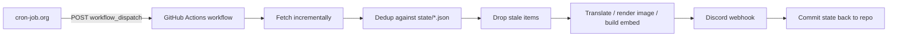

# discord-news

[](https://github.com/EST320/discord-news/actions/workflows/tests.yml)

Financial news and market-indicator trackers that run on GitHub Actions and post to Discord. Each tracker pulls incrementally from a public data source, deduplicates, filters, formats, and delivers through a Discord webhook.

In production since July 2026. Deduplication state is committed back to the repository after every run, so the commit history doubles as the run log.

## Trackers

| Tracker | Source | Posts | Cadence |
|---|---|---|---|
| [`wallstreetcn`](discord_news/wallstreetcn.py) | Wallstreetcn live feed: US, A-share and HK channels | Headline + body | Every 2 minutes per channel |
| [`truth_social`](discord_news/truth_social.py) | CNN's public Truth Social archive | Chinese translation + card image of the original post | Every 2 minutes |
| [`fear_greed`](discord_news/fear_greed.py) | CNN Fear & Greed Index, alternative.me Crypto Fear & Greed Index | Gauge chart, historical comparison, change since last run | Scheduled |
| [`earnings_calendar`](discord_news/earnings_calendar.py) | Finnhub earnings calendar and company profile APIs | Table image of next week's earnings, Monday to Friday | Every Friday |
| [`backfill`](discord_news/backfill.py) | Wallstreetcn (all three channels) | Flash news missed during an outage window | Manual |
| [`x_tracker`](discord_news/x_tracker.py) | Selected X / Twitter accounts | Tweets | **Experimental, not in production** |

The Wallstreetcn feed is Chinese, and Truth Social posts are translated into Chinese, so the Discord output is Chinese-language. Code, logs and documentation are in English.

## How it works



1. **Incremental fetch.** Page through the source by cursor and stop at the first already-seen item or the first page that falls outside the age window. No full scans.
2. **Dedup.** Compare item IDs against the state file. The Truth Social archive can return the same post under different IDs, so that tracker adds a second layer keyed on a hash of the content.
3. **Age filter.** Skip items that are too old or have no timestamp (15 minutes for flash news, 12 hours for Truth Social), so historical content is never pushed by accident.
4. **Format.** Translate with DeepL, render images with Pillow / Matplotlib / Plotly, and build the Discord embed.
5. **Deliver.** Post through a Discord webhook. An item is written to state **only after it has been delivered**, so a failure midway neither repeats what was sent nor loses what wasn't.
6. **Persist.** The workflow commits the state file back to the repository for the next run to read.

## Repository layout

```text
discord-news/
├── .github/workflows/
│   ├── news.yml / news-a.yml / news-hk.yml   # Wallstreetcn US / A-share / HK
│   ├── news-trump.yml                        # Truth Social
│   ├── feargreed.yml                         # Fear & Greed indices
│   ├── news-earnings.yml                     # Weekly earnings calendar
│   ├── backfill.yml                          # Manual backfill
│   ├── news-x.yml                            # X tracker (experimental)
│   └── tests.yml                             # Unit tests on code changes
├── discord_news/
│   ├── wallstreetcn.py                       # One module, three channels
│   ├── backfill.py                           # Reuses wallstreetcn parsing and posting
│   ├── truth_social.py
│   ├── fear_greed.py
│   ├── earnings_calendar.py
│   ├── x_tracker.py
│   └── paths.py                              # Repo-relative state/ and assets/ paths
├── scripts/
│   └── inspect_wallstreetcn_tags.py          # Debug helper: dump raw API fields
├── state/                                    # Dedup state, one JSON file per tracker
├── assets/                                   # Static images used in generated cards
├── tests/
└── requirements.txt
```

Every tracker is a module run with `python -m discord_news.<name>` from the repository root.

## Reliability

| Problem | Handling |
|---|---|
| Source API fails temporarily | Wallstreetcn: up to 3 attempts with linear backoff; if it still fails the run is skipped without failing the workflow, and the next run catches up |
| Discord rate limit (HTTP 429) | Wait for the returned `retry_after`, then retry. Wallstreetcn caps this at 5 attempts per message |
| Exception midway through a run | Wallstreetcn writes state in a `finally` block; Truth Social saves state after every delivered post |
| Corrupt state file | Treated as empty state; the run takes the first-run path instead of crashing |
| First run | Wallstreetcn sends only the latest 10 items and marks the rest as seen; Truth Social only records a baseline and sends nothing |
| State file growth | Entries are pruned after a retention period (12 hours for flash news, 30 days for Truth Social) |
| Concurrent runs writing state | Workflows that write state use a `concurrency` group so each tracker runs serially; state commits `git pull --rebase` first and retry with random jitter on push conflicts |
| Gaps after an outage | `backfill` re-sends a time window, skipping recorded IDs, with a `DRY_RUN` mode |

## Design decisions

### Triggering: an external scheduler calls `workflow_dispatch`

Flash news needs a steady poll roughly every 2 minutes. GitHub Actions' built-in `schedule` is delayed or skipped under load and cannot hold that cadence, so an external scheduler (cron-job.org) triggers the workflows through the GitHub REST API:

```text
cron-job.org, every N minutes
  → POST /repos/{owner}/discord-news/actions/workflows/{workflow}.yml/dispatches   body: {"ref": "main"}
  → workflow runs the tracker → posts to Discord → commits the state file
```

A side benefit is that changing the cadence, pausing or resuming a tracker needs no code change. Only `news-trump.yml` also keeps a `schedule` trigger as a fallback; every other workflow runs on `workflow_dispatch` alone, which also allows manual runs from the Actions page for debugging.

Because the scheduler addresses workflows by file name, **the workflow file names are part of the external interface** and should not be renamed without updating the scheduler.

Setup:

1. Create a fine-grained personal access token with Actions write permission on this repository only.
2. In the scheduler, create a POST job with these headers:
   ```text
   Authorization: Bearer YOUR_GITHUB_TOKEN
   Accept: application/vnd.github+json
   ```
3. Use `{"ref": "main"}` as the request body.

### State lives in the repository

- **Upside.** Zero cost and no database or extra service to run. Every state change is versioned, so problems can be traced back through history.
- **Cost.** Every run that sends something produces a commit, which floods the history and grows the repository; concurrent workflows need conflict handling (see the table above).
- **Next step.** If this grows further, state moves to SQLite or a key-value store and only code stays in the repository.

## State file format

Each file under `state/` records when an ID (and, for Truth Social, a content hash) was first handled. Entries past the retention period are dropped on the next save.

```json
{
  "seen":   { "1234567890": 1784326800.12 },
  "hashes": { "a1b2c3...": 1784326800.12 }
}
```

Only `truth_social` uses `hashes`. `state/seen_feargreed.json` instead stores the last posted value of each index. A `seen` file can safely be reset to `{"seen": {}}`: the tracker takes its first-run path and does not flood the channel with history.

## Tracker notes

### Wallstreetcn live news

- Covers the US, A-share and HK channels through `api-one-wscn.awtmt.com`, the API domain the Wallstreetcn web frontend currently uses.
- One module serves all three; the channel is a command-line argument (`us`, `a` or `hk`) and per-channel settings live in the `CHANNELS` table.
- Each run reads at most 10 pages and sends at most 100 items.

### Truth Social

- Reads the public Truth Social archive JSON maintained by CNN.
- Deduplicates on both post ID and content hash.
- The English original is rendered as a card image; the DeepL Chinese translation goes in the embed description, and the title links back to the original post.

### Fear & Greed

- Fetches the CNN stock-market index and the alternative.me crypto index; either can fail without blocking the other.
- Draws a gauge with Matplotlib, alongside historical values and the change since the previous run.

### Earnings calendar

- Runs on Fridays and covers Monday to Friday of the **following** week, leaving a week to prepare.
- Keeps only companies above a USD 10 billion market cap, looked up through Finnhub's company profile endpoint.
- Groups by before-market-open (BMO) and after-market-close (AMC), sorts by market cap within each group, and renders the table with Plotly.

### Backfill

- Shares parsing and posting code with the live tracker, so backfilled messages look identical.
- Inputs: `HOURS` (how far back to look), `CHANNELS` (any of `us,a,hk`), `DRY_RUN` (list pending items without sending).
- Runs locally or from `backfill.yml` on the Actions page.

### X tracker (experimental)

Not in production: there is currently no reliable way to fetch the data.

## Running locally

```bash
pip install -r requirements.txt

export DISCORD_WEBHOOK_URL="your_webhook_url"
python -m discord_news.wallstreetcn us

# Backfill dry run: list US and HK items missed in the last 6 hours, send nothing
HOURS=6 CHANNELS=us,hk DRY_RUN=true python -m discord_news.backfill

# Unit tests (standard library only)
python -m unittest discover -s tests -v
```

`truth_social` and `fear_greed` have a `TEST_MODE` switch near the top of the file. When enabled, they send a sample message to verify the webhook, translation and image pipeline without touching real state.

## Configuration (GitHub Secrets)

| Name | Used for |
|---|---|
| `DISCORD_WEBHOOK_URL` | US flash news channel |
| `DISCORD_WEBHOOK_URL_A` | A-share flash news channel |
| `DISCORD_WEBHOOK_URL_HK` | HK flash news channel |
| `DISCORD_WEBHOOK_URL_TRUMP` | Truth Social channel |
| `DISCORD_WEBHOOK_URL_FEARGREED` | Fear & Greed channel |
| `DISCORD_WEBHOOK_URL_EARNINGS` | Earnings calendar channel |
| `DEEPL_API_KEY` | DeepL translation |
| `FINNHUB_API_KEY` | Finnhub earnings and company data |

## Known limitations and roadmap

- Tests cover only the Wallstreetcn tracker (parsing, dedup, age window, state pruning, failure handling). The other trackers are next.
- `truth_social`, `fear_greed` and `earnings_calendar` retry Discord 429 responses without an upper bound, and each carries its own copy of the webhook-posting code. A shared Discord client with bounded retries would fix both.
- Move state out of the repository (see [Design decisions](#design-decisions)).

## Disclaimer

A personal project for learning and automation practice. All content remains the property of its original source.
